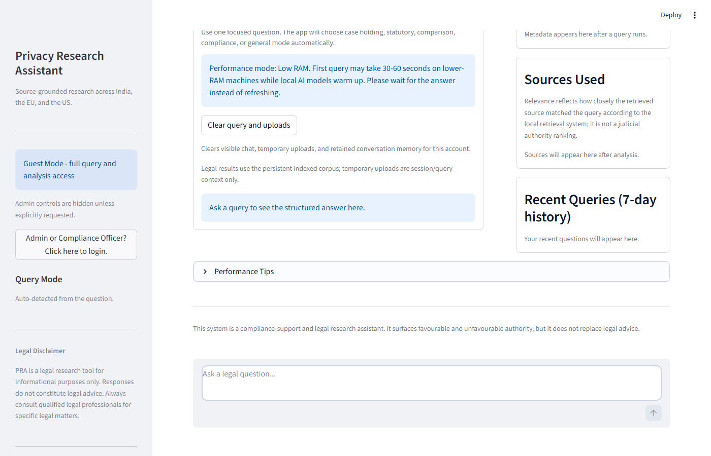
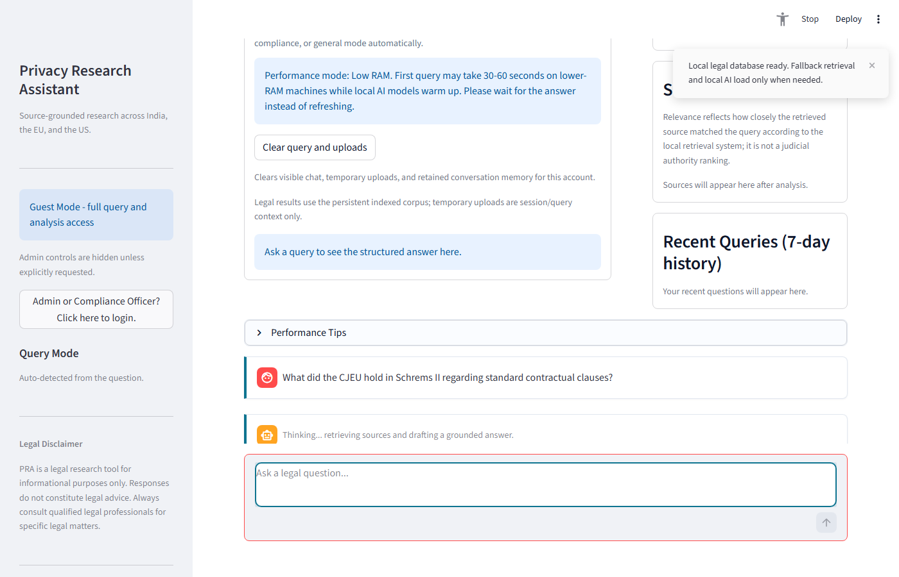
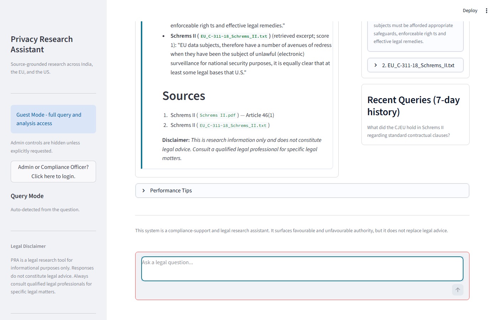
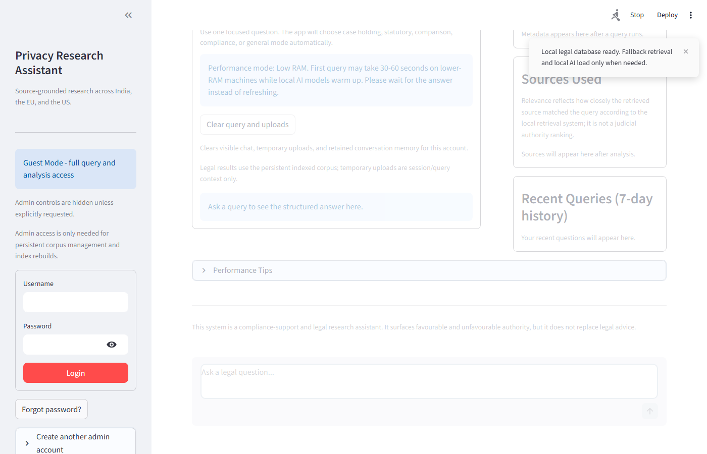
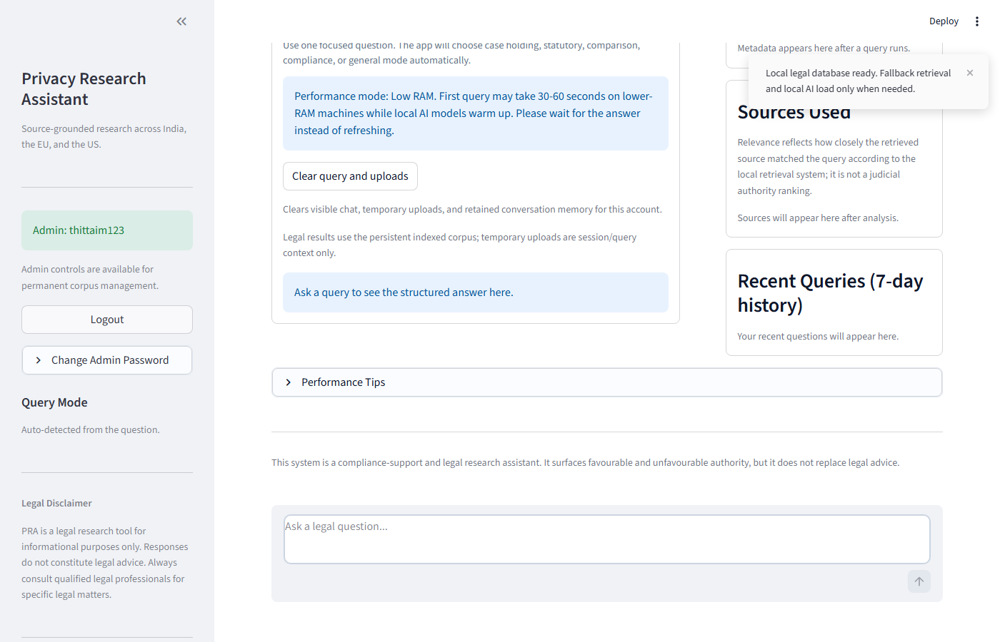

# Privacy Research Assistant (PRA)

> A fully offline, air-gapped AI research tool for privacy law — built for legal teams, compliance officers, and privacy professionals who cannot expose sensitive queries to cloud AI services.

---

## What Is PRA?

The Privacy Research Assistant is a Retrieval-Augmented Generation (RAG) application that lets users ask natural-language questions about privacy law and receive grounded, cited answers — entirely on-device, with no internet connection required at runtime.

It indexes a curated corpus of statutes, regulations, and landmark court judgments across multiple jurisdictions (EU, India, United States) and combines vector search with a locally-hosted LLM to synthesise answers.

---

## UI Screenshots

| Main Interface | Query Processing | Query Answer + Sources |
|---------------|-----------------|----------------------|
|  |  |  |

| Sources Panel | Login Form | Admin Logged In |
|--------------|-----------|----------------|
|  |  |  |

---

## Key Capabilities

| Capability | Detail |
|-----------|--------|
| **Natural-language Q&A** | Ask questions in plain English; receive structured, cited answers |
| **Multi-jurisdiction corpus** | EU (GDPR, ePrivacy, CJEU case law), India (DPDP Act), US (FTC enforcement) |
| **Document upload & analysis** | Upload PDFs/TXT/JSON for ad-hoc analysis; OCR support for scanned documents |
| **PII detection** | Built-in scanner flags personal data in uploaded documents before ingestion |
| **Fully offline** | No API calls to OpenAI, Azure, or any cloud service at runtime |
| **Role-based auth** | Per-user SQLite authentication with PBKDF2-SHA256 (200,000 iterations) |
| **Encrypted local storage** | Conversation memory and config encrypted with Fernet symmetric encryption |
| **Admin audit trail** | Every privileged action is written to an append-only JSONL audit log |

---

## Tech Stack

| Layer | Technology |
|-------|-----------|
| **Frontend** | [Streamlit](https://streamlit.io/) |
| **LLM inference** | [Ollama](https://ollama.ai/) — Mistral 7B (Q&A), Phi-3 3.8B (compliance/doc analysis) |
| **Embeddings** | nomic-embed-text via Ollama |
| **Vector retrieval** | [LlamaIndex](https://www.llamaindex.ai/) — 30,000+ indexed chunks |
| **Structured data** | SQLite (auth, legal sources, case metadata) |
| **OCR** | Tesseract 5 + pdf2image / Poppler |
| **Encryption** | Python `cryptography` (Fernet) |

---

## Knowledge Base Articles

- [Feature Walkthrough](docs/features.md)
- [Legal Corpus Coverage](docs/legal-corpus.md)

---

## Design Principles

1. **Air-gapped by design** — no data ever leaves the machine; suitable for regulated environments
2. **Source-grounded answers** — every response includes the chunk, document, and jurisdiction it came from
3. **Prompt injection hardening** — retrieved legal text is wrapped in XML tags and sanitised before the LLM sees it
4. **No hallucinated authority** — non-opinion documents use document-summary prompts, not case-analysis headings
5. **Deterministic citation** — case titles are resolved from SQLite (zero LLM calls for metadata)

---

*This repository is a showcase of the PRA tool's knowledge base and UI. The full source code is maintained in a private repository.*
